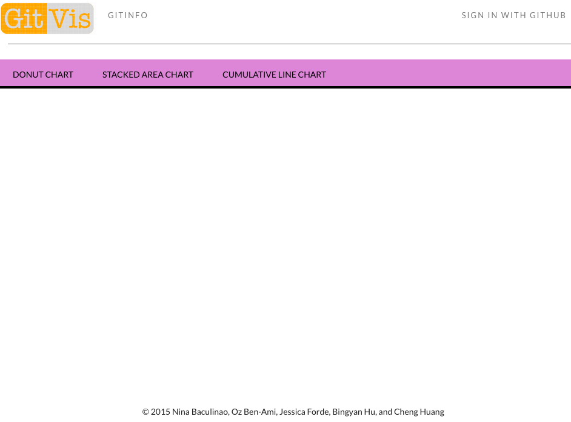
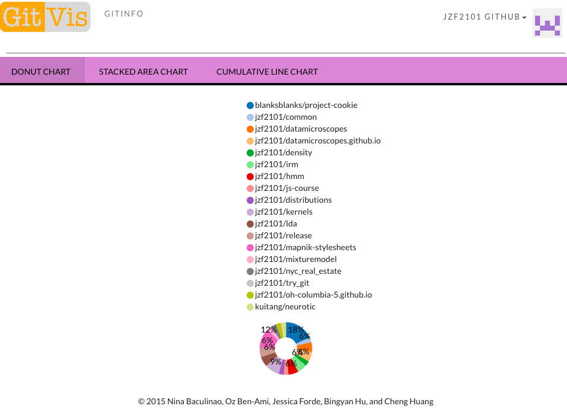

#[GitVis](https://project-cookie.herokuapp.com) :octocat:
---


GitHub has become a major social network, changing the way developers collaborate. As users, we want to understand our git activities. While GitHub does offer graph services, it provides limited options to visualize an individual's activity.

GitVis is an interactive data visualization of the activities of a GitHub user and his/her repositories.

###Check it out at [project-cookie.herokuapp.com](https://project-cookie.herokuapp.com)

---

##Overview

###Home Page


###Login with GitHub authentication


###Stacked area chart for individual repos 


###Donut chart of multiple repos


###Gitinfo displays user data as a JSON


---

##Tools & Libraries
- [GitHub API](https://developer.github.com/v3/)
- [D3](http://d3js.org/)
- [Mongoose](http://mongoosejs.com/)
- [Angular](https://angularjs.org/)
- [Express](http://expressjs.com/)
- [Node](https://nodejs.org/)

---

##Team Info: Project Cookie:cookie:

| UNI      | Github Username  | Full Name      | School      | Year |
|---------:|------------------|----------------|-------------|------|
|  nb2406  | blanksblanks     | Nina Baculinao | CE (prev CC)| 2015 |
|  yob2000 | ozzieba          | Oz Ben-Ami     | SEAS        | 2015 |
|  jzf2101 | jzf2101          | Jessica Forde  | CE          | 2015 |
|  bh2447  | bingyanzen       | Bingyan Hu     | BC          | 2016 |
|  ch2994  | ch2994           | Cheng Huang    | SEAS        | 2016 |

---
##What we've accomplished
- ###GitHub oAuth
- ###Using promises to asynchronously query data from GitHub's API
- ###Interactive graphs based on GitHub user data using D3:
	- Donut chart
	- Stacked area chart
	- Cumulative line chart

##What we found most difficult
- ###Authentication
- ###Migrating to Heroku from our old server
- ###Using D3 within our Angular framework

##What we found most rewarding
- ###Querying raw data from github
- ###Making interactive visualizations! 
- ###Experimenting with [Material Design](http://www.google.com/design/spec/material-design/introduction.html)

##Problems
- ###We were unable to complete all our desired charts
- ###GitHub collaboration issues
	- GitHub doesn't list Cheng as a collaborator on the project despite his contribuitions to the repo

---

##Local Installation

Make sure you have the necessary .env and .envdist files!

```shell
npm install
bower install
grunt build
node server.js
```

---

##MVP Milestones

Week 1 (2/15 - 2/21/2015)
- [x] Research D3 and Github API and create a Wiki page for such information
- [x] INITIAL PROJECT OUTLINE DUE SUN 2/15 @ 11:59PM

Week 2 (2/22 - 2/28/2015) - _finishing a basic build_
- [x] Set up OAuth for GitHub and make the static mockups for the visualization graphs
- [x] FIRST MILESTONE DUE SUN 2/22 @ 11:59PM
- [X] All day intensive workshop for team projects on Sat 2/28

Week 3 (3/1 - 3/7/2015) - _finishing all core functionality_
- [x] Set up the mechanism to request data and information from Github
- [X] SECOND MILESTONE DUE SUN 3/1 @ 11:59PM

Week 4 (3/8 - 3/11/2015) - _finishing the polish_
- [x] Make visualizations go live on Heroku

---

##More Information
GitVis is an open source project we developed as the final project for our JavaScript class at Columbia University. Check out our Wiki Pages for more information about our planning and research process:

- [Home](https://github.com/blanksblanks/project-cookie/wiki)
- [Architecture](https://github.com/blanksblanks/project-cookie/wiki/Architecture)
- [GitHub API](https://github.com/blanksblanks/project-cookie/wiki/GitHub-API)
- [Interactive Data Visualization in JS](https://github.com/blanksblanks/project-cookie/wiki/Interactive-Data-Visualization-in-JS)
- [Mockup](https://github.com/blanksblanks/project-cookie/wiki/Mockup)
- [Meeting Notes](https://github.com/blanksblanks/project-cookie/wiki/Notes-from-Meeting-with-Lev-(2-18-15))

